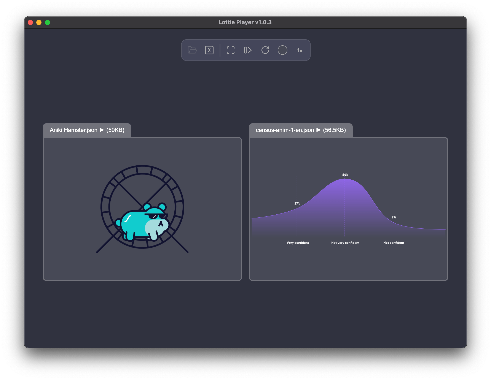

 

# Lottie Player

This is a player for playing Lottie Animation files (.json files), these files are generally rendered from various services or  platforms like Adobe After Effects, Rive, LottieFiles and more.

Lottie Player is an Electron-based desktop apps intended to run locally, it is **free to use** to all.

You can also download it from:
### <a href="https://lottieplayer.com" target="_blank">Lottie Player Official Website</a>

Enjoy!

 

## Features:

 - View and Play Lottie Animations (.json files)
 - Synchronizing two different animations
 - Play animations in Full Screen or Side by Side
 - Click an animation to Pause or Play it
 - Playing animations in Loop or Play Once
 - Changing playback speed to half, regular or double speed
 - Selecting background color for animations

## Installation:

 - Download the latest release file
 - Extract the ZIP file
 - Copy the APP file to your Application folder
 - Double click to open Lottie Player
 - If it does not open for security reasons, click "Done"
 - Go to "System Settings" then click "Privacy & Security", then click "Open" and "Open Anyway"
 - For more info, see [Apple's official guide](https://support.apple.com/en-il/guide/mac-help/mh40616/mac)

## Releases

Latest: [v1.0.3 for Mac OS (Apple silicon)](https://github.com/Adir-SL/LottiePlayer/releases/download/v1.0.3/LottiePlayer-1.0.3-Apple-Silicon.zip)

##

## Roadmap

Future features to add:
 - ~~Select background color for animations~~
 - ~~Adding playback speed controls~~
 - ~~Show file names and/ or file sizes~~
 - ~~Making a version for Microsoft Windows~~
 - Animated SVG support
 - More file support (including .lottie)
