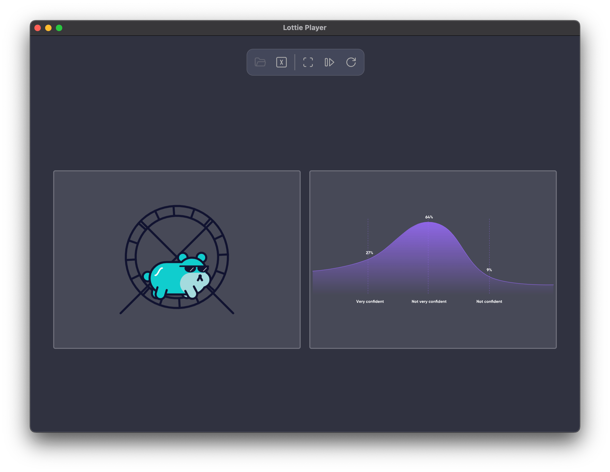

# Lottie Player

<!--  -->

 

<h1>Lottie Player</h1>

 

## Features:

 - View and Play Lottie Animations (.json files)
 - Synchronizing two different animations
 - Play animations in Full Screen or Side by Side
 - Click an animation to Pause or Play it
 - Paying animations in Loop or Play Once

## Releases

Latest: [v1.0.0 for Mac OS](https://github.com/Adir-SL/LottiePlayer/releases/download/v1.0.0/Lottie-Player-mac_v1.0.0.zip)